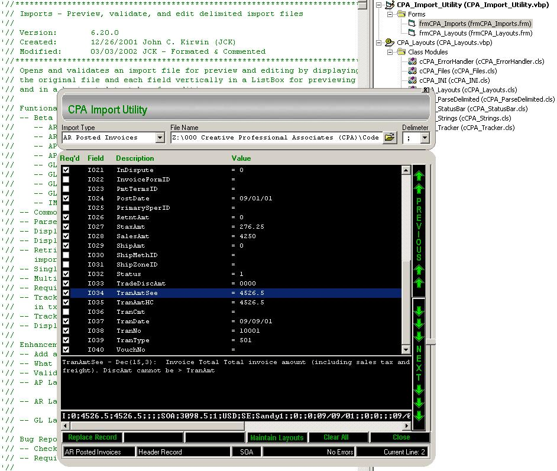



## CPA Import Utility

### Description

Preview, validate, and edit delimited database import files.
 
### More Info
 
Delimited import file (samples included)

INI layout file (sample included)

Opens and validates an import file for preview and editing by displaying the original file and each field vertically in a ListBox for previewing and in a horizontal text box for editing.

             |
---                |---
**Submitted On**   |2002-10-02 17:01:14
**By**             |[John C Kirwin](https://github.com/Planet-Source-Code/PSCIndex/blob/master/ByAuthor/john-c-kirwin.md)
**Level**          |Advanced
**User Rating**    |4.9 (49 globes from 10 users)
**Compatibility**  |VB 6\.0
**Category**       |[Complete Applications](https://github.com/Planet-Source-Code/PSCIndex/blob/master/ByCategory/complete-applications__1-27.md)
**World**          |[Visual Basic](https://github.com/Planet-Source-Code/PSCIndex/blob/master/ByWorld/visual-basic.md)
**Archive File**   |[CPA\_Import1398521022002\.zip](https://github.com/Planet-Source-Code/john-c-kirwin-cpa-import-utility__1-39438/archive/master.zip)

